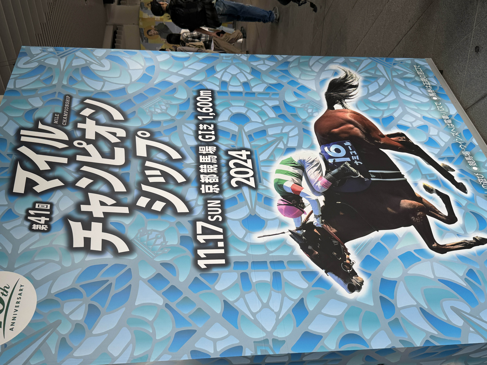
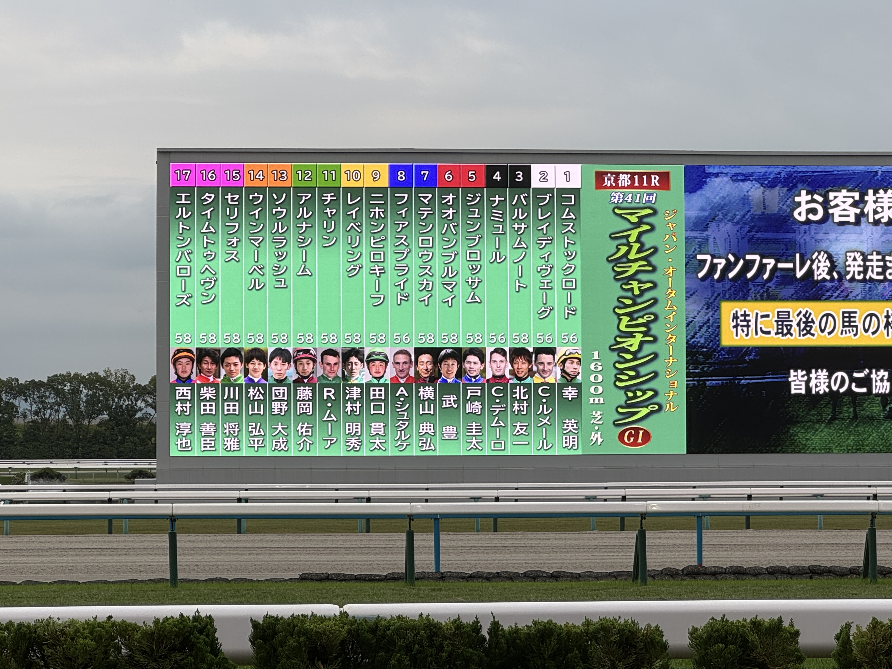
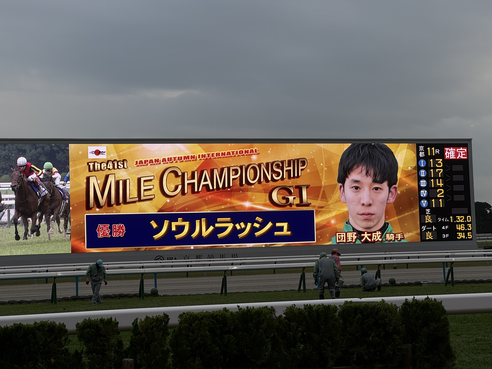
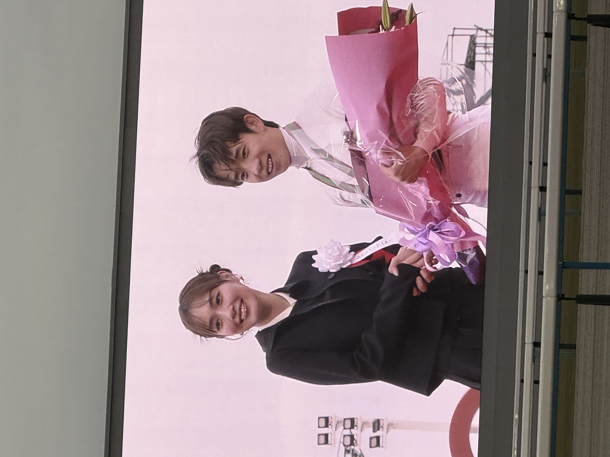

11/16(土) に TSKaigi Kansai 2024 のセッションに登壇してきたので、その振り返りをしていく〜☝️

[発表サマリ](https://kansai.tskaigi.org/talks/tocomi)

[登壇資料](https://speakerdeck.com/tocomi/xing-tietuku-su-du-gai-shan-fen-dou-ji)

## 登壇の背景

### 個人的なモチベーション

前から「大きいカンファレンスで一度は登壇してみたい！」という気持ちはあった。いい経験になるだろうし、個人的な資産にもなるしということで。

あとは、シンプルに目立つのが好き笑。昔は「目立ちたい」っていう気持ちを恥ずかしいと思って隠してたけど、最近は「これが自分なんだな」と素直に受け入れられるようになってきた😌

### 会社のメンバーとしてのモチベーション

もう1つの大きなモチベーションは、会社の知名度向上。社内で会社のプレゼンテーションを向上するために色々と活動してくれている有志がいて、それに応えたいなという気持ちがあった。

だから、ただ自分が登壇するだけじゃなくて他のメンバーにも登壇してもらいたいなと思って、チーム全体を巻き込んでプロポーザル案を出したり、ブラッシュアップしたりしてみた。

その結果、自分を含めて社内から3人のプロポーザルが通ってめちゃくちゃ嬉しかった！一緒に京都行けて楽しかったし！笑

## 資料作成

資料作成では、できるだけ伝わりやすさを意識して、図やビジュアルを積極的に使ってみた。結果的に、内容はある程度分かりやすく仕上がったかなと感じてる✍️

ただ、ソースコードを表示するスライドでは反省点が🥲

背景色や文字の色、フォントサイズなど、会場の広さや明るさを考慮しきれず、見づらくなってしまった部分があった。次回はそういう点も考慮したうえで資料を作らなきゃなと反省。

## 発表当日

リハをしっかりやったおかげか、発表自体は落ち着いてできた！時間が余り気味になるのが分かっていたので、意識的にゆっくり話すようにしたのも良かったかも。同僚には落ち着きすぎて怖かったと言われた😂

お気に入りのパドレスの帽子を被って登壇したのも地味に嬉しいポイント。笑

ただ、落ち着きすぎたのが逆に課題でもあったかな。自分のキャラクターをもう少し出したかったし、仕込んでいたネタも、前の canalun のときの会場の反応を見て日和ってしまい流しちゃったから、次回はもう少し攻めたい！

## 発表を終えて

発表が終わってTwitter(現X)を見たら、好意的なコメントが多かったので一安心。

「デモが良かった！」とコメントでも懇親会でも言ってもらえて、失敗を恐れずやってよかったなと思った。

調査をする中で知った [speedscope](https://www.speedscope.app/) も紹介できたので、これをきっかけに使う人が増えたら嬉しいな〜

## 次のアクション

今回登壇してみて、運営スタッフの方々がどんなふうにカンファレンスを作り上げているのか興味が湧いた。次回は登壇するだけでなくスタッフとしても関わってみたいと思い、早速応募してみた！

また、プロポーザルをチームで作る活動は引き続き続けていこうと思ってる。みんなで一緒に考えて、ブラッシュアップしていくプロセスは楽しいし、良い学びになるので、これからも続けていってチームを盛り上げていきたい💪

## 余談

カンファレンスの翌日は京都競馬場でマイルCSを見に行った🏇

なお馬券は😇

団野くんおめでとう🎉
